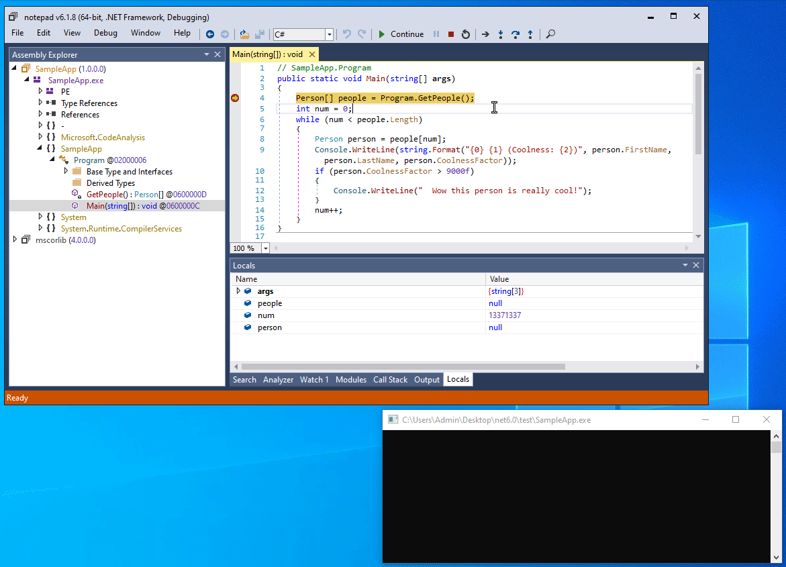

# Proxy Object Obfuscation

This repository contains a proof-of-concept implementation for applying Proxy Object obfuscation to .NET modules.


## What is Proxy Object Obfuscation?

Proxy Object Obfuscation is a method for hiding the state of objects from .NET debuggers throughout a debugging session.
It does so by replacing the values displayed in the Locals window with garbage data, making it confusing for a reverse engineer to step through the code easily:

For more information on the technical details and applications, read [this blog post](https://washi.dev/blog/debugger-proxy-objects).




## How to Build

Use an IDE such as Visual Studio or JetBrains Rider to open the project. 
Alternatively, run the following in the root directory:

```console
$ dotnet build
```

The project targets .NET 6.0. Make sure you have the right SDK installed or else downgrade to your current installation of .NET.


## How To Use

Run the program with the target input file as a command-line argument:

```console
$ ProxyObjects path/to/input/file.exe
```

An output file will be generated in the designated `Output` folder next to your input file.

For more advanced options, run:

```console
$ ProxyObjects --help
```
